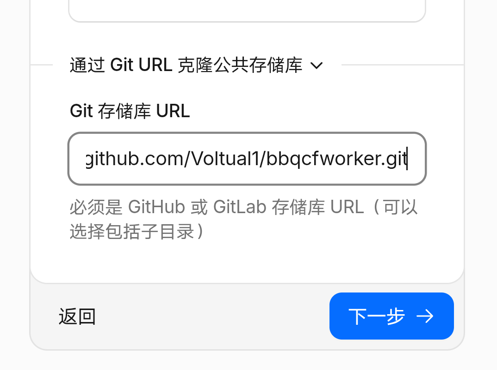
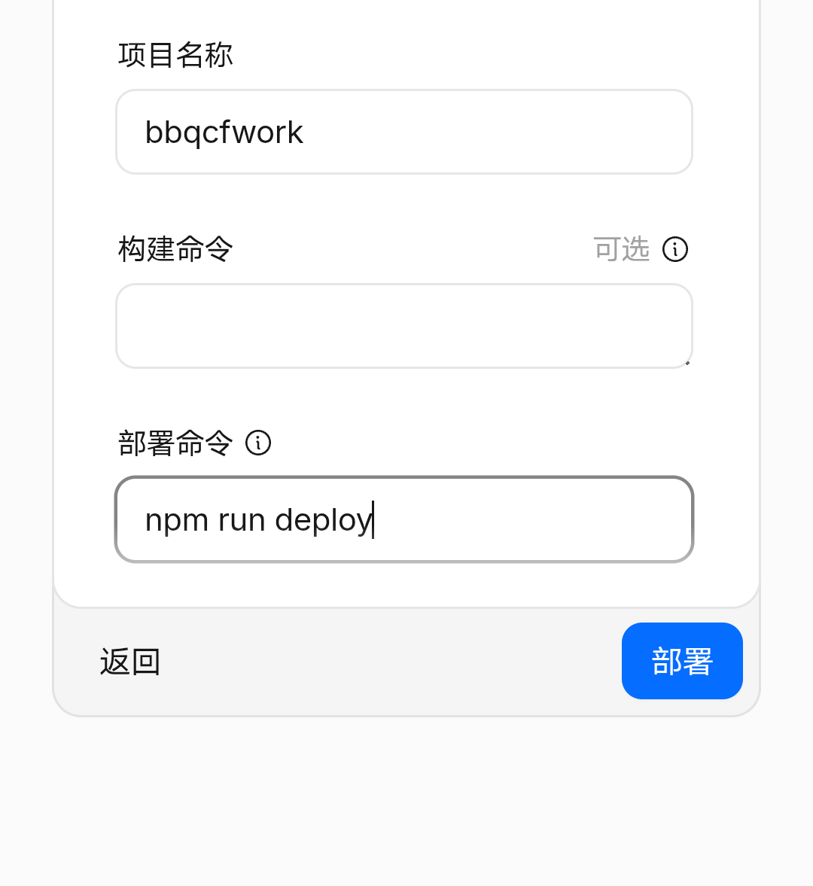

# Pyrolysis - Cloudflare Workers & Compose WASM Deployment

[](https://workers.cloudflare.com/)
[](https://kotlinlang.org/)

本项目是 [BBQ (Pyrolysis)](https://gitee.com/Voltula/bbq) 跨端应用的 **Web WebAssembly (WASM)** 全栈部署版本。通过爆改 Vite + Hono + Cloudflare Workers 模板，将 Kotlin Multiplatform (KMP) 编译产出的 Compose HTML/WASM 静态资源与 Hono 边缘计算后端完美融合，实现全球超低延迟的边缘端托管。
点击创建应用，然后选择Github滑到下面，Git-存储库URL填
https://github.com/Voltual1/bbqcfworker.git
[]
点击下一步
然后
部署时构建命令留空，部署命令填"npm run deploy"即可
[]
---
部署完成后你可以自定义域名（不自定义域名国内不能直接访问🙃）

### 前端 (Client - Kotlin Compose WASM)
直接把Wasm的构建产物丢进位于 `dist/client` 目录里就完事
（通常情况下这里面已经有提前准备好的构建产物了，以后要更新部署的版本只需要先清空dist/client，把发行版的构建产物解压进去好了）

### 后端 (Server - Hono & Cloudflare Workers)
位于 `src/worker` 目录，驱动边缘计算：
### 核心边缘网关 (`src/worker/index.ts`) 的核心作用

`src/worker/index.ts` 是整个应用的边缘流量调度中枢，它直接运行在 Cloudflare 节点上。它实现了以下特性：

#### 1. 动态分流 (Reverse Proxy)
* **API 动态代理**：拦截所有 `/api/` 开头的请求，无缝转发至 (`http://apk.xiaoqu.online`)
识别 `/upload` 路由，将文件流分发至挽悦云 (`http://wanyueyun-x.xbjstd.cn:9812`)
识别 `/proxy-img/`，自动代理图片请求防止加载图片失败

#### 3. WASM & OPFS 强绑定
* 针对 Kotlin Compose WASM 依赖的现代底层存储技术（如 `sqlite3.wasm` 依托的 **OPFS - Origin Private File System** 异步代理），网关在返回静态资源时，强制注入了极其严苛的顶级浏览器隔离响应头：
    ```http
    Cross-Origin-Opener-Policy: same-origin
    Cross-Origin-Embedder-Policy: require-corp
    ```
    *没有这两个安全响应头，现代浏览器将出于安全保护，直接拒绝初始化多线程 WASM 与本地 SQLite 数据库。*